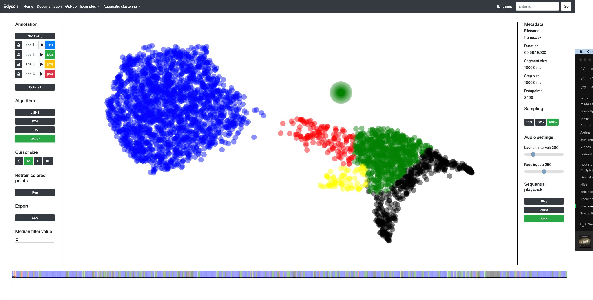

# Edyson - a tool for exploring audio quickly

Edyson is a human-in-the-loop framework for exploring, and to some extent annotating, large amounts of audio efficiently. It uses the openSMILE feature extration tool and unsupervised machine learning to help the user browse and listen to their data. The project is a prototypical work in progress and should by no means be viewed as a finished product.

[ONLINE DEMO](https://perfall.github.io/Edyson/index.html) (use Chrome)

[VIDEO](https://youtu.be/3reUtg54hYM)


Edyson is built on the idea of Temporally Disassembled Audio, as such it segments an audio file into short snippets of equal length and distributes them on a 2D map according to some chosen feature. See publications below for further information on this.


## Getting started
Clone the repository and install the requirements. Tested on python 3.6:

```
pip install -r requirements.txt
```

Install [openSMILE](https://www.audeering.com/opensmile/), name the root folder "opensmile" and put it inside the Edyson directory (alternatively change the pointers in python/audio_processing.py).

Start the flask server from inside /web:

```
python app.py
```

Navigate to localhost:3134, preferably using Chrome. You might need to zoom out ("cmd/ctrl" + "-"") and reload the page for everything to fit.

Before processing audio of your own I recommend testing out the included examples, choose one from the header tab. See functionality and controls [here](misc/cheatsheet.pdf).

### Docker

Alternatively, to run the app using Docker, first [install Docker](https://docs.docker.com/get-docker/) and clone this repo (`git clone https://github.com/perfall/Edyson.git`). Then build your image by running `docker build -t edyson .` from the root of the cloned repo. Then you can start a container with your image by running `docker run -d --name edyson -p 3134:3134 edyson`.

## Process your audio
Choose an audio file, wav or mp3. Select segment size (duration of snippet), step size (the duration between two consecutive snippets), and features (currently only MFCC and mean-normalized MFCC). Click process audio.

The time it takes for processing is mostly dependent on how many resulting datapoints are generated. As an example, an hour of audio with a segment size and step size of 1000ms (3600 datapoints) currently takes around 3 minutes on a maxed out 2016 MacBook Pro.

The processed audio can be stored to avoid having to process it a second time. Simply take a note of the ID in the end of the url, alternatively add it to the "examples.txt" file for convenient access.

## Publications
[How to annotate 100 hours in 45 minutes](https://www.isca-speech.org/archive/Interspeech_2019/pdfs/1648.pdf)

[Bringing Order to Chaos: A Non-Sequential Approach for Browsing Large Sets of Found Audio Data](https://www.aclweb.org/anthology/L18-1680) (early version of the method)


## Screenshot

